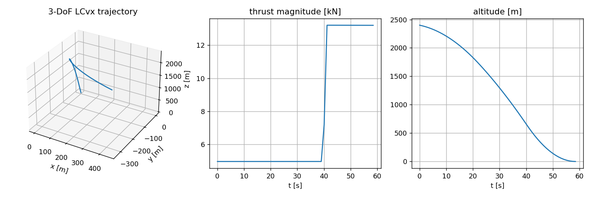
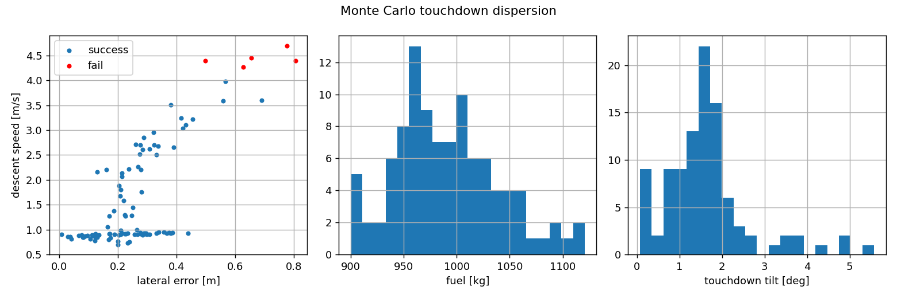

# pdg

Powered descent guidance in C++17. No external dependencies, not even Eigen.

This implements the convex-optimization approach to rocket landing: lossless
convexification for the 3-DoF minimum fuel problem, and successive
convexification (SCvx) for the full 6-DoF problem with free final time and
state-triggered constraints. Both run on top of a small interior-point SOCP
solver written for embedded-style use: all memory is allocated in setup, solve
calls don't allocate, and iteration counts are capped everywhere. There is also
a 6-DoF rigid body simulator, a simple TVC tracking autopilot and a Monte Carlo
dispersion runner, so you can actually fly the trajectories you compute and see
what the touchdown statistics look like.

Most published implementations of this material are Python or MATLAB research
scripts that call a desktop solver. I wanted the whole stack in one place, in
C++, with tests.

## What's in here

- `pdg::socp`: primal-dual interior point SOCP solver. Homogeneous self-dual
  embedding, Nesterov-Todd scaling, Mehrotra predictor-corrector. The KKT
  systems go through a sparse LDL^T with static and dynamic regularization plus
  iterative refinement against the unregularized matrix, which is essentially
  the ECOS recipe. Ordering is RCM with dense columns pushed to the end (the
  free-final-time variable couples every dynamics row, so this matters).
  Detects primal and dual infeasibility through the embedding.
- `pdg::lcvx`: 3-DoF minimum fuel powered descent after Acikmese & Ploen (2007)
  and Blackmore et al. (2010). The nonconvex lower thrust bound is handled by
  the usual lossless relaxation, and the tests check that it really is
  lossless (||u|| = sigma at the optimum). Free final time is a golden section
  search over tf; every evaluation has the same sparsity pattern, so the
  symbolic factorization is reused. One solve takes about 17 ms at N=55 on my
  laptop.
- `pdg::scvx`: 6-DoF successive convexification with free final time via time
  dilation, following Szmuk & Acikmese (arXiv:1802.03827). First-order-hold
  control, discretization by integrating the state transition matrices, virtual
  control for recursive feasibility, and a hard trust region with the
  accept/reject ratio test from Mao et al. Converges in around 25 iterations
  (about half a second) and the result is dynamically consistent to ~1e-8
  single-shooting defect.
- State-triggered constraints: g(x,u) < 0 implies c(x,u) <= 0, written as
  -min(g,0)*c <= 0 and linearized in each subproblem, per Szmuk, Reynolds &
  Acikmese (2020). Compound triggers (AND/OR) are supported, see also Uzun,
  Acikmese & Carson (arXiv:2510.09610). A speed-triggered angle of attack
  limit ships as a ready-made example.
- `pdg::sim`: RK4 rigid body sim with a dispersed plant: thrust scale, Isp
  error, engine misalignment, first-order actuator lag. Plus a tracking
  autopilot that feeds forward the reference attitude and gimbal command and
  closes PD loops on position and attitude. Roll is left uncontrolled, because
  a single gimbaled engine has no roll authority anyway.
- `pdg::mc`: Monte Carlo runner. Each sample disperses the initial state and
  the plant, re-solves SCvx guidance from the dispersed state, and flies it
  closed loop. RNG is counter-based per sample, so results are bit-identical
  no matter how many threads you use. Writes a CSV per sample.

## Building

```bash
git clone https://github.com/Krataios14/pdg.git
cd pdg
cmake -S . -B build -DCMAKE_BUILD_TYPE=Release
cmake --build build
ctest --test-dir build
```

C++17, CMake >= 3.16. Tested with GCC 13; CI also builds MSVC and clang.

## Usage

3-DoF, classic Mars descent numbers:

```cpp
#include <pdg/lcvx.hpp>

pdg::LcvxParams P;                       // defaults are the classic Mars case
pdg::LcvxPlanner planner(P);
pdg::LcvxSolution sol;
planner.solveFreeTf(40.0, 100.0, sol);   // search tf in [40, 100] s
// sol.r, sol.v, sol.thrust, sol.mass per node; sol.tf; sol.fuelUsed
```



The thrust profile is the textbook min-max bang-bang you expect from the
minimum fuel problem: coast down at minimum throttle, then brake hard at the
end. If your solution doesn't look like this, something is wrong.

6-DoF with a state-triggered constraint:

```cpp
#include <pdg/scvx.hpp>

pdg::ScvxParams P;                       // a Falcon-ish single stick, T/W ~ 1.7
P.stcs.push_back(pdg::makeSpeedTriggeredAoA(40.0, 35.0));
pdg::ScvxPlanner planner(P);
pdg::ScvxSolution sol;
planner.solve(sol);
// sol.x: [m, r, v, q, w] per node, sol.u: body thrust, sol.tf: free final time
```

Monte Carlo:

```cpp
#include <pdg/mc.hpp>

pdg::ScvxParams nominal;
pdg::MonteCarloRunner mc(nominal, pdg::McDispersions{}, pdg::McConfig{});
pdg::McResults res = mc.run();
```

Output of `ex_monte_carlo 100` (dispersed initial state, 2% thrust scale, 1%
Isp, 0.2 deg engine cant, 50 ms actuator lag):

```
guidance converged : 100
landed             : 100
success            : 95  (95.0%)
lateral error      : mean 0.27 m, std 0.15 m, p95 0.57 m, max 0.81 m
descent speed      : mean 1.63 m/s, max 4.69 m/s
tilt at touchdown  : mean 1.63 deg, max 5.57 deg
```



That run takes about 11 seconds: each sample is a full SCvx solve plus a 6-DoF
closed-loop flight. The examples write CSVs; `examples/plot_results.py` makes
plots like the ones above if you have matplotlib.

A note on the thrust margin: minimum fuel trajectories finish the braking burn
at max thrust, so a plant that underperforms by even 2% leaves the autopilot
with nothing to work with and you land hard. The MC runner therefore plans
guidance with 10% of max thrust held back (`guidanceThrustMargin`). This is the
kind of thing you only notice once you close the loop, which is half the reason
the simulator exists.

## Embedded use

The solver separates setup from solve. `SocpSolver::setup()` computes the
symbolic factorization and allocates everything; `solve()` touches no heap and
runs a bounded number of iterations. `workspaceBytes()` tells you the
footprint. The SCvx subproblem keeps the same sparsity pattern across
iterations, so a planner instance pays the symbolic cost exactly once. No
exceptions on the hot path, status codes only.

I would not fly this without a lot more V&V, obviously, but the structure is
the right one for that path.

## Layout

```
include/pdg/   public headers (linalg, socp, rocket, lcvx, scvx, sim, mc)
src/           implementations
tests/         five suites covering every layer
examples/      ex_3dof_mars, ex_6dof_landing, ex_monte_carlo
```

## References

1. Acikmese, Ploen, "Convex Programming Approach to Powered Descent Guidance
   for Mars Landing", JGCD 30(5), 2007.
2. Blackmore, Acikmese, Scharf, "Minimum-Landing-Error Powered-Descent Guidance
   for Mars Landing Using Convex Optimization", JGCD 33(4), 2010.
3. Szmuk, Acikmese, "Successive Convexification for 6-DoF Mars Rocket Powered
   Landing with Free-Final-Time", arXiv:1802.03827.
4. Szmuk, Reynolds, Acikmese, "Successive Convexification for Real-Time 6-DoF
   Powered Descent Guidance with State-Triggered Constraints", JGCD 43(8), 2020.
5. Uzun, Acikmese, Carson, "Sequential Convex Programming for 6-DoF Powered
   Descent Guidance with Continuous-Time Compound State-Triggered Constraints",
   arXiv:2510.09610.
6. Domahidi, Chu, Boyd, "ECOS: An SOCP Solver for Embedded Systems", ECC 2013.
7. Mao, Szmuk, Acikmese, "Successive Convexification of Non-Convex Optimal
   Control Problems and Its Convergence Properties", CDC 2016.
8. Vandenberghe, "The CVXOPT Linear and Quadratic Cone Program Solvers", 2010.

## License

MIT.
